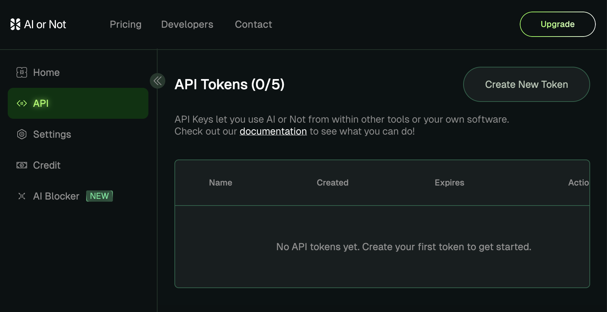
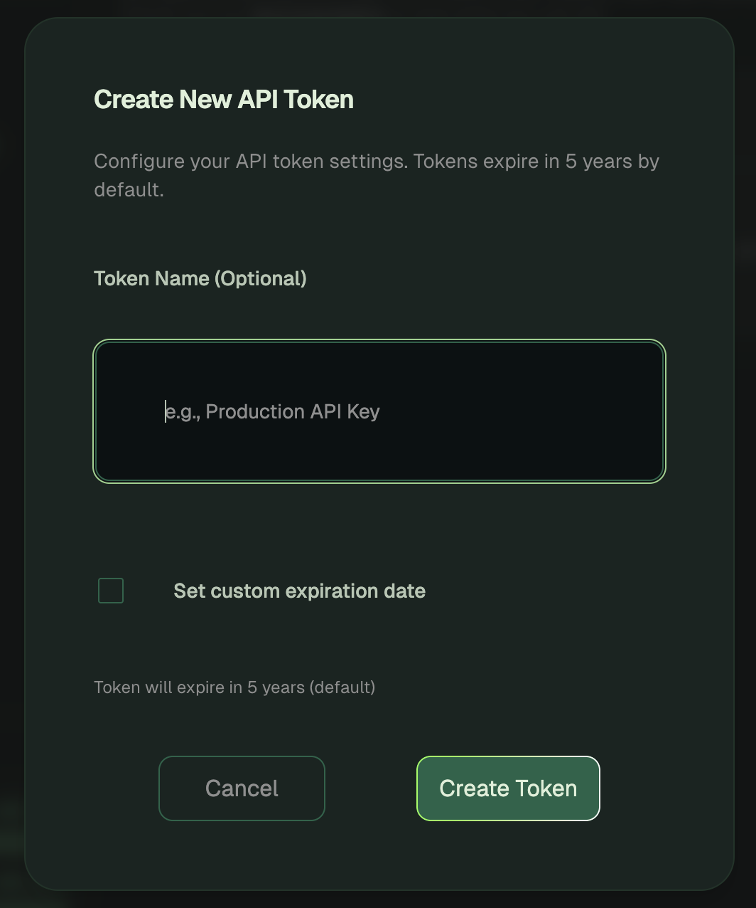

# AIORNOT Python Client


[](https://badge.fury.io/py/aiornot)
[](https://uptime.betterstack.com/?utm_source=status_badge)

Python client for the [AIORNOT](https://aiornot.com) API - detect AI-generated content in images, videos, audio, and text.

## Features

- **Image Analysis**: Detect AI-generated images, deepfakes, NSFW content, and more
- **Video Analysis**: Analyze videos for AI-generated content, synthetic voices, and deepfakes
- **Voice Analysis**: Detect AI-generated speech
- **Music Analysis**: Detect AI-generated music
- **Text Analysis**: Detect AI-generated text with block-level annotations
- **Batch Processing**: Process multiple files concurrently with progress tracking
- **Sync & Async**: Both synchronous and asynchronous clients available

## Installation

```bash
# As a library dependency
uv add aiornot    # or: pip install aiornot

# As a CLI tool (no install needed)
uvx aiornot --help
```

Requires Python 3.10+.

## Quick Start

### API Key Setup

Register for an account at [AIORNOT](https://aiornot.com) and get your API key from your [dashboard](https://aiornot.com/dashboard/api).



Click `Create New Token` to open the dialog:



Copy your token after creating it.

> [!WARNING]
> Never share your API key with anyone. It is like a password.

Set it as an environment variable (recommended):

```bash
export AIORNOT_API_KEY=your_api_key
```

Or pass it directly to the client:

```python
from aiornot import Client

client = Client(api_key="your_api_key")
```

### Basic Usage

```python
from aiornot import Client

client = Client()

# Analyze an image
resp = client.image_report_from_file("path/to/image.jpg")
print(f"Verdict: {resp.verdict}")      # "ai" or "human"
print(f"Confidence: {resp.confidence}") # 0.0 to 1.0
print(f"Is AI: {resp.is_ai()}")         # True or False

# Analyze text
resp = client.text_report("Some text to analyze for AI generation.")
print(f"Is AI: {resp.is_ai()}")

# Analyze voice audio
resp = client.voice_report_from_file("path/to/speech.mp3")
print(f"Verdict: {resp.verdict}")

# Analyze music
resp = client.music_report_from_file("path/to/song.mp3")
print(f"Verdict: {resp.verdict}")

# Analyze video
resp = client.video_report_from_file("path/to/video.mp4")
print(f"AI Video: {resp.ai_video_detected}")
print(f"AI Voice: {resp.ai_voice_detected}")
```

### Async Client

```python
import asyncio
from aiornot import AsyncClient

async def main():
    client = AsyncClient()

    # All methods are async
    resp = await client.image_report_from_file("image.jpg")
    print(f"Verdict: {resp.verdict}")

asyncio.run(main())
```

## Analysis Types

### Image Analysis

Control which analyses to run using `only` or `excluding`:

```python
from aiornot import Client, ImageAnalysisType

client = Client()

# Only run AI detection and deepfake analysis
resp = client.image_report_from_file(
    "image.jpg",
    only=[ImageAnalysisType.AI_GENERATED, ImageAnalysisType.DEEPFAKE]
)

# Run all except NSFW detection
resp = client.image_report_from_file(
    "image.jpg",
    excluding=[ImageAnalysisType.NSFW]
)

# Access results
print(f"AI Generated: {resp.is_ai()}")
print(f"Deepfake: {resp.is_deepfake()}")
print(f"NSFW: {resp.is_nsfw()}")

# Generator detection (if AI detected)
if resp.report.ai_generated and resp.report.ai_generated.generator:
    gen = resp.report.ai_generated.generator
    print(f"Midjourney confidence: {gen.midjourney.confidence}")
```

Available `ImageAnalysisType` values:
- `AI_GENERATED` - AI image detection
- `DEEPFAKE` - Face manipulation detection
- `NSFW` - Adult content detection
- `QUALITY` - Image quality assessment
- `REVERSE_SEARCH` - Reverse image search

### Video Analysis

```python
from aiornot import Client, VideoAnalysisType

client = Client()

resp = client.video_report_from_file(
    "video.mp4",
    only=[VideoAnalysisType.AI_VIDEO, VideoAnalysisType.DEEPFAKE_VIDEO]
)

print(f"AI Video: {resp.ai_video_detected} ({resp.ai_video_confidence:.1%})")
print(f"AI Voice: {resp.ai_voice_detected}")
print(f"AI Music: {resp.ai_music_detected}")
print(f"Deepfake: {resp.deepfake_detected}")
```

Available `VideoAnalysisType` values:
- `AI_VIDEO` - AI-generated video detection
- `AI_VOICE` - Synthetic voice detection
- `AI_MUSIC` - AI-generated music detection
- `DEEPFAKE_VIDEO` - Deepfake detection

### Text Analysis

```python
client = Client()

# Basic text analysis
resp = client.text_report("Text to analyze...")
print(f"Is AI: {resp.is_ai()}")
print(f"Confidence: {resp.confidence}")

# With block-level annotations
resp = client.text_report(
    "First paragraph here. Second paragraph here.",
    include_annotations=True
)
for block, confidence in resp.annotations:
    print(f"[{confidence:.1%}] {block[:50]}...")
```

## Batch Processing

Process multiple files concurrently:

```python
from pathlib import Path
from aiornot import Client

client = Client()

# Process multiple images
images = list(Path("images").glob("*.jpg"))
results = client.image_report_batch(
    images,
    max_concurrency=5,
    on_progress=lambda done, total: print(f"{done}/{total}")
)

print(f"Total: {results.total}")
print(f"Succeeded: {results.succeeded}")
print(f"Failed: {results.failed}")
print(f"Success rate: {results.success_rate:.1%}")

# Access individual results
for result in results.results:
    if result.success:
        print(f"{result.input}: {result.result.verdict}")
    else:
        print(f"{result.input}: Error - {result.error}")

# Process a directory
results = client.image_report_directory(
    "path/to/images",
    recursive=True,
    max_concurrency=5
)

# Process from CSV
results = client.image_report_from_csv(
    "files.csv",
    key="file_path",
    base_directory="/data/images"
)
```

## CLI Usage

```bash
# Install
uv tool install aiornot

# Configure API key
aiornot token config

# Analyze files
aiornot image photo.jpg
aiornot video clip.mp4
aiornot voice speech.mp3
aiornot music song.wav
aiornot text "Some text to analyze"
aiornot text --file document.txt
```

### Output Formats

```bash
# JSON output (default)
aiornot image photo.jpg --format json

# Human-readable table
aiornot image photo.jpg --format table

# Minimal (verdict + confidence)
aiornot image photo.jpg --format minimal

# Just the verdict
aiornot image photo.jpg --quiet
```

### Analysis Filtering

```bash
# Only run specific analyses
aiornot image photo.jpg --only ai_generated --only deepfake

# Exclude analyses
aiornot image photo.jpg --excluding nsfw --excluding quality
```

### Batch Processing

Process multiple files with JSONL output:

```bash
# Process multiple files
aiornot batch image photo1.jpg photo2.png photo3.webp

# Process a directory
aiornot batch image --dir ./photos
aiornot batch image --dir ./photos --recursive

# Process from CSV file
aiornot batch image --csv files.csv --key image_path
aiornot batch image --csv files.csv --key filename --base-dir /data/images

# Output options
aiornot batch image --dir ./photos --output results.jsonl  # Write to file
aiornot batch image --dir ./photos --format summary        # Summary only
aiornot batch image --dir ./photos --format quiet          # Exit code only

# Control concurrency and progress
aiornot batch image --dir ./photos --concurrency 10 --progress
aiornot batch image --dir ./photos --fail-fast  # Stop on first error
```

Available batch commands: `image`, `video`, `voice`, `music`, `text`

JSONL output format (one JSON object per line):
```jsonl
{"status":"success","input":"photo1.jpg","result":{...}}
{"status":"error","input":"photo2.jpg","error":"FileNotFound","message":"..."}
{"status":"summary","total":2,"succeeded":1,"failed":1,"success_rate":0.5}
```

## Error Handling

```python
from aiornot import Client
from aiornot.exceptions import (
    AIORNotAuthenticationError,
    AIORNotValidationError,
    AIORNotRateLimitError,
    AIORNotTimeoutError,
)

client = Client()

try:
    resp = client.image_report_from_file("image.jpg")
except AIORNotAuthenticationError:
    print("Invalid API key")
except AIORNotValidationError as e:
    print(f"Invalid input: {e}")
except AIORNotRateLimitError:
    print("Rate limit exceeded")
except AIORNotTimeoutError:
    print("Request timed out")
```

## License

MIT
