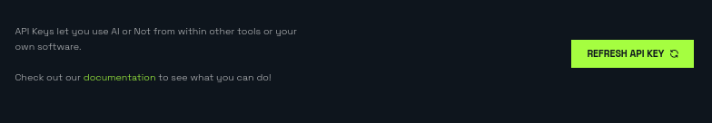

# AIORNOT Python Client


[](https://badge.fury.io/py/aiornot)
[](https://uptime.betterstack.com/?utm_source=status_badge)

This is a Python client for the [AIORNOT](https://aiornot.com) API.

# Getting Started

## Account Registration and API Key Generation

Register for an account at [AIORNOT](https://aiornot.com). After creating an account,
you can generate an API key via your [dashboard](https://aiornot.com/dashboard/api). If you
just created your account, the page looks like,


Click the `Request API Key` button to generate a new API key. After generating a key, the page
looks like,


Press the `Copy API Key` button to copy the key to your clipboard. If you already have
generated an API key, the page looks like,



Press the `Refresh API Key` button to generate a new API key. Then press the `Copy API Key` button
to copy the key to your clipboard.

> [!WARNING]  
> Never share your API key with anyone. It is like a password.

## Installing the Python Package

To install the python package, run the following command,

```bash
pip install aiornot
```

Using the client requires an API key. You can set the API key in two ways. 

The easier and more flexible way is to set an environment variable,

```bash
AIORNOT_API_KEY=your_api_key
```

Otherwise, you can pass the api key in as an argument to the client,

```python
from aiornot import Client, AsyncClient


client = Client(api_key='your_api_key')               # sync client
async_client = AsyncClient(api_key='your_api_key')    # async client
```

Failure to set either the environment variable or the api key argument will result in a runtime error.

## View from 10,000 feet

```python
from aiornot import Client

# Create a client (reads AIORNOT_API_KEY env)
client = Client()

# Classify an image by url
resp = client.image_report_by_url('https://thispersondoesnotexist.com')

# Classify an image by path
resp = client.image_report_by_file('path/to/image.jpg')

# Classify audio by url
resp = client.audio_report_by_url('https://www.youtube.com/watch?v=v4WiI4es_UI')

# Classify audio by path
resp = client.audio_report_by_file('path/to/audio.mp3')

# Check your token
resp = client.check_token()

# Refresh your token
resp = client.refresh_token()

# Revoke your token
resp = client.revoke_token()

# Check if the API is up
resp = client.is_live()
```

There is also an async client that has the same methods as the sync client, but as coroutines.

```python
import asyncio
from aiornot import AsyncClient


async def main():
    client = AsyncClient()
    if await client.check_api():
        print('API is up!')
    else:
        print('API is down :(')


if __name__ == '__main__':
    asyncio.run(main())
```


## CLI Usage

AIOrNot also comes with a CLI. You can use it easily via a [pipx](https://pypa.github.io/pipx/) installation,

```bash
# For fresh install
pipx install aiornot

# For upgrade
pipx upgrade aiornot
```

The CLI also looks for the `AIORNOT_API_KEY` environment variable. But it will also
look for a `~/.aiornot/config.json` file if the environment variable is not set. To
set it up, run the following command,

```bash
aiornot token config
``````

and follow the prompts. Afterwards, you can see a menu of commands with,

```bash
aionot
```

the two most useful ones being,

```bash
# Classify an image by url or path
aiornot image [url|path]

# Classify audio by url or path
aionot audio [text]
```