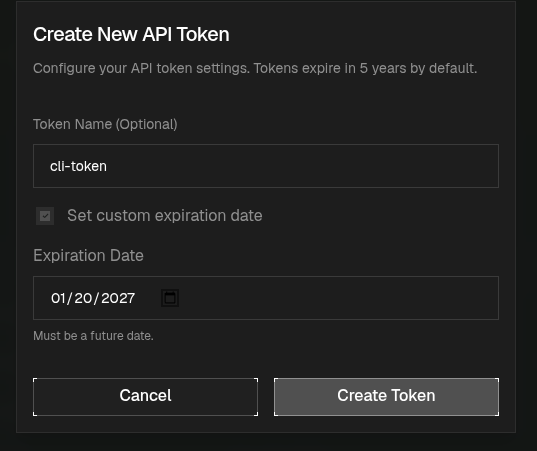

# AIORNOT Python Client


[](https://badge.fury.io/py/aiornot)
[](https://uptime.betterstack.com/?utm_source=status_badge)

CLI, MCP server, and Python SDK for the [AIORNOT](https://aiornot.com) API.

AIORNOT supports image, text, video, voice, and music analysis. Use the CLI for
local files and batch workflows, the MCP server to expose analysis tools to
MCP-compatible clients, or the Python client in your application code.

## Quick Start

AIORNOT requires Python 3.9 or newer. The MCP server requires Python 3.10 or newer.

We recommend [uv](https://docs.astral.sh/uv/) because it can run the CLI with
`uvx`, launch the MCP server, install the SDK, manage isolated global tools, and
provide `uvx` for the URL download workflow.

Install `uv` on macOS or Linux:

```bash
curl -LsSf https://astral.sh/uv/install.sh | sh
```

On Windows:

```powershell
powershell -ExecutionPolicy ByPass -c "irm https://astral.sh/uv/install.ps1 | iex"
```

See the [uv installation docs](https://docs.astral.sh/uv/getting-started/installation/)
for package manager options such as Homebrew, pipx, and pip.

Get an API token from the [AIORNOT dashboard](https://aiornot.com/dashboard/api),
then set it for your current shell:

```bash
export AIORNOT_API_KEY=your_api_key
```

Run the CLI without permanently installing it:

```bash
uvx aiornot image single path/to/image.jpg
```

Or run the MCP server:

```bash
uvx --from "aiornot[mcp]" aiornot-mcp
```

For Python application code, add the SDK to your project:

```bash
uv add aiornot
```

```python
from aiornot import Client

client = Client()
resp = client.image_report_by_file_sync("path/to/image.jpg")

print(resp.report.ai_generated.verdict)
print(resp.report.ai_generated.ai.confidence)
```

Prefer `pip` instead:

```bash
pip install aiornot
```

## Authentication

Using AIORNOT requires an API token. Register at [AIORNOT](https://aiornot.com),
then generate a token from your [dashboard](https://aiornot.com/dashboard/api).

Click `Create New API Token`. A dialog opens where you can configure the token:



- **Token Name (Optional)**: a label to help you identify the token later, such
  as `cli-token`.
- **Set custom expiration date**: check this to choose your own expiration date.
  Tokens expire in 5 years by default; custom expiration dates must be in the
  future.

Click `Create Token`, then copy the token immediately.

> [!WARNING]
> Never share your API token with anyone. It is like a password. Copy it as soon
> as it is created, since you will not be able to view it again afterwards.

Supported authentication methods:

- **CLI**: reads `AIORNOT_API_KEY`, `AIORNOT_API_TOKEN`, or
  `~/.aiornot/config.json`. Run `uvx aiornot token config` to save a token for
  CLI use.
- **MCP server**: reads `AIORNOT_API_KEY`, `AIORNOT_API_TOKEN`, or
  `~/.aiornot/config.json`. Passing `AIORNOT_API_KEY` in the MCP config keeps
  the setup explicit.
- **Python SDK**: reads `AIORNOT_API_KEY`, or accepts `Client(api_key=...)`.
  Setting `AIORNOT_API_KEY` in the environment is usually simplest.

If no token is available, requests that require authentication raise a runtime
error.

## CLI Usage

The `aiornot` package includes a CLI. The easiest way to use it is with `uvx`,
which runs the latest package in an isolated environment:

```bash
uvx aiornot
```

For repeated use, install it as a global uv tool:

```bash
uv tool install aiornot
```

Upgrade the global tool later with:

```bash
uv tool upgrade aiornot
```

Configure a saved CLI token:

```bash
uvx aiornot token config
```

After configuration, list available commands:

```bash
uvx aiornot
```

### Common CLI Commands

```bash
# Classify an image by path
uvx aiornot image single path/to/image.jpg

# Classify text from a file or stdin
uvx aiornot text single path/to/text.txt
cat path/to/text.txt | uvx aiornot text single -

# Classify a video by path
uvx aiornot video single path/to/video.mp4

# Classify voice or music audio by path
uvx aiornot voice single path/to/voice.mp3
uvx aiornot music single path/to/music.mp3
```

Each media command supports a `single` subcommand. Image, text, video, voice, and
music also support batch workflows.

### CLI Filters

Use `--only` to request specific analysis types, or `--excluding` to skip
specific analysis types:

```bash
uvx aiornot image single path/to/image.jpg \
  --external-id my-id \
  --only ai_generated \
  --only deepfake
uvx aiornot video single path/to/video.mp4 --only ai_video --only deepfake_video
```

### URL Downloads

Video, voice, and music commands can download media from a URL before analysis:

```bash
# Download the first ~120 seconds of a video URL, classify it, and keep the file
uvx aiornot video from-url "https://example.com/video"

# Download the first ~1 hour of audio from a URL, classify it, and keep the file
uvx aiornot voice from-url "https://example.com/video-or-audio"
uvx aiornot music from-url "https://example.com/video-or-audio"
```

URL workflows shell out to `uvx yt-dlp@latest`, so `uvx` must be available on
`PATH`. Video downloads ask yt-dlp for the best available video and audio format.
Voice and music downloads request the best audio-only format.

Useful URL options:

```bash
# Choose a different video duration cap
uvx aiornot video from-url "https://example.com/video" --max-duration 300

# Download the full video or audio
uvx aiornot video from-url "https://example.com/video" --max-duration 0
uvx aiornot music from-url "https://example.com/video-or-audio" --max-duration 0

# Delete the downloaded file after analysis
uvx aiornot video from-url "https://example.com/video" --delete-after
uvx aiornot music from-url "https://example.com/video-or-audio" --delete-after
```

Retained downloads are written under `aiornot-downloads/` by default using a
readable title-and-id filename. Video URL downloads default to `--max-duration
120`; voice and music URL downloads default to `--max-duration 3600`. Duration
limiting uses yt-dlp/ffmpeg download sections without forcing a re-encode, so
cuts may align to keyframe or container boundaries rather than being exact to
the millisecond.

### Batch CLI Workflows

Batch commands append JSONL records with an `input` object for correlation, an
`ok` flag, and either a `response` object or an `error` object.

```bash
# Batch from CSV files. The CSV should include a path column by default.
uvx aiornot image batch-csv images.csv --output image-results.jsonl
uvx aiornot text batch-csv texts.csv --output text-results.jsonl

# Batch by scanning folders. Resume is enabled by default and skips successful
# input IDs already present in the JSONL output file.
uvx aiornot video batch-scan ./videos --output video-results.jsonl
uvx aiornot voice batch-scan ./voice --output voice-results.jsonl
uvx aiornot music batch-scan ./music --output music-results.jsonl

# Generate stable external IDs from scanned relative paths.
uvx aiornot image batch-scan ./images \
  --output image-results.jsonl \
  --use-relpath-md5-as-external-id
```

CSV batches use `path`, `source`, or `file` columns for files. Text CSV batches
can also use a `text` column for literal text. Optional CSV columns include `id`
and `external_id`; `external_id` must be 36 characters or fewer. Image and video
CSV batches can also include `only` and `excluding` columns. Text CSV batches can
include `include_annotations`.

For `batch-scan`, external IDs are not generated by default. Pass
`--use-relpath-md5-as-external-id` to send the MD5 hex digest of each file's
relative path as its external ID.

## MCP Server

AIORNOT can run as a local stdio MCP server for clients that support the Model
Context Protocol. The MCP server exposes the same analysis operations as the CLI
and reads the API key from `AIORNOT_API_KEY`, `AIORNOT_API_TOKEN`, or
`~/.aiornot/config.json`.

Run the MCP server with the optional MCP dependencies:

```bash
uvx --from "aiornot[mcp]" aiornot-mcp
```

Example local MCP client configuration:

```json
{
  "mcpServers": {
    "aiornot": {
      "command": "uvx",
      "args": ["--from", "aiornot[mcp]", "aiornot-mcp"],
      "env": {
        "AIORNOT_API_KEY": "your_api_key"
      }
    }
  }
}
```

The server provides these tools:

- `aiornot_check_token`
- `aiornot_analyze_image_file`
- `aiornot_analyze_text`
- `aiornot_analyze_text_file`
- `aiornot_analyze_video_file`
- `aiornot_analyze_video_url`
- `aiornot_analyze_voice_file`
- `aiornot_analyze_voice_url`
- `aiornot_analyze_music_file`
- `aiornot_analyze_music_url`
- `aiornot_batch_csv`
- `aiornot_batch_scan`

The `aiornot_analyze_video_url` tool accepts `url`, `output_dir`,
`max_duration`, `delete_after`, `external_id`, `only`, and `excluding`, matching
the CLI URL workflow. The `aiornot_analyze_voice_url` and
`aiornot_analyze_music_url` tools accept `url`, `output_dir`, `max_duration`,
and `delete_after`. The batch tools write the same JSONL records as the CLI.

## Python SDK Usage

For the Python SDK, the environment variable is usually simplest:

```bash
export AIORNOT_API_KEY=your_api_key
```

You can also pass the token directly:

```python
from aiornot import AsyncClient, Client

client = Client(api_key="your_api_token")
async_client = AsyncClient(api_key="your_api_token")
```

### Sync Client

```python
from aiornot import Client

client = Client()

# Check your token
token_status = client.check_token()

# Check if the API is up
if client.is_live():
    print("API is up!")

# Classify an image by path
image_resp = client.image_report_by_file_sync("path/to/image.jpg")

# Classify text
text_resp = client.text_report_sync("Text to analyze")

# Classify video, voice, or music by path
video_resp = client.video_report_by_file_sync("path/to/video.mp4")
voice_resp = client.voice_report_by_file_sync("path/to/voice.mp3")
music_resp = client.music_report_by_file_sync("path/to/music.mp3")

print(image_resp.report.ai_generated.verdict)
print(image_resp.report.ai_generated.ai.confidence)
```

### Async Client

The async client has the same method names as the sync client, but each request
method is awaited.

```python
import asyncio

from aiornot import AsyncClient


async def main():
    client = AsyncClient()

    if await client.is_live():
        print("API is up!")

    image_resp = await client.image_report_by_file_sync("path/to/image.jpg")
    text_resp = await client.text_report_sync("Text to analyze")

    print(image_resp.is_ai())
    print(text_resp.metadata.word_count)


if __name__ == "__main__":
    asyncio.run(main())
```

### Optional Parameters

Image and video analysis support optional `only` and `excluding` filters:

```python
resp = client.image_report_by_file_sync(
    "path/to/image.jpg",
    external_id="my-tracking-id",
    only=["ai_generated", "deepfake"],
    excluding=["nsfw"],
)
```

Valid image filter values are `ai_generated`, `deepfake`, `nsfw`, `quality`, and
`reverse_search`. Valid video filter values are `ai_video`, `ai_music`,
`ai_voice`, and `deepfake_video`.

Image, text, and video analysis also support an optional `external_id` for your
own tracking. It is sent only when explicitly provided, and must be 36 characters
or fewer.

Text analysis supports optional annotations:

```python
text_resp = client.text_report_sync(
    "Text to analyze",
    include_annotations=True,
    external_id="my-tracking-id",
)
```

The Python client retries transient request failures by default, including HTTP
408, 409, 425, 429, 500, 502, 503, and 504 responses.

## Response Structure

The API returns comprehensive reports with forward compatibility. New fields can
be added over time.

```python
# Main response
resp.id  # Unique report ID
resp.created_at  # Timestamp
resp.external_id  # Your tracking ID, if provided

# AI generation detection
resp.report.ai_generated.verdict  # "ai", "human", or "unknown"
resp.report.ai_generated.ai.is_detected  # Boolean
resp.report.ai_generated.ai.confidence  # Float 0-1
resp.report.ai_generated.human.is_detected  # Boolean
resp.report.ai_generated.human.confidence  # Float 0-1

# Generator probabilities, if AI is detected
resp.report.ai_generated.generator.midjourney  # Float or None
resp.report.ai_generated.generator.dall_e  # Float or None
# ... and other generators

# Other image analysis, if requested
resp.report.deepfake
resp.report.nsfw
resp.report.quality

# Image metadata
resp.report.meta.width
resp.report.meta.height
resp.report.meta.format
resp.report.meta.size_bytes
resp.report.meta.md5

# Text metadata is top-level
text_resp.metadata.word_count
text_resp.metadata.character_count
text_resp.metadata.token_count

# Video metadata
video_resp.report.meta.duration
video_resp.report.meta.total_bytes
video_resp.report.deepfake_video  # Deepfake video detection, if requested
```
